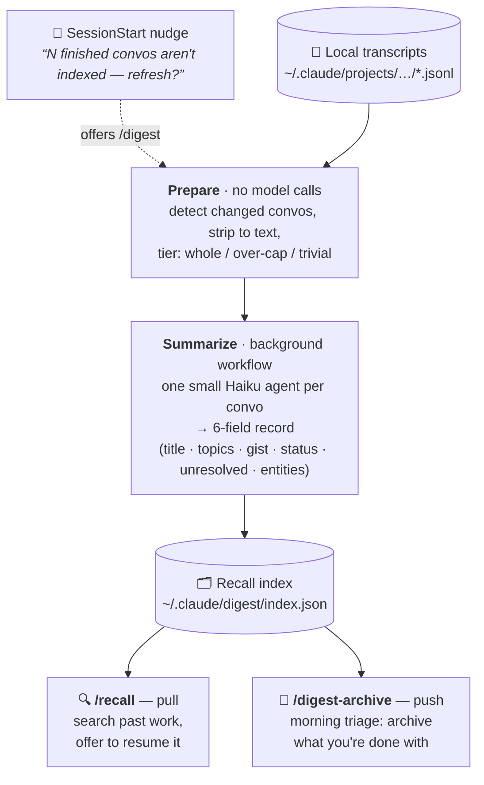

# convo-digest

A Claude Code plugin that summarizes your **finished conversations** into a
searchable **recall index**, so you (and Claude) can find past work when you start
something new — and triage what you're done with.

Runs entirely **locally on your Claude Code subscription**. No API key, no data
leaves your machine.

## What you get

Skills (namespaced under `convo-digest`):

| Skill | What it does |
| :---- | :----------- |
| `/convo-digest:digest` | Summarize conversations that changed since the last run into the recall index. |
| `/convo-digest:recall` | Find a relevant past conversation for what you're starting on, and offer to resume it. |
| `/convo-digest:digest-archive` | Review recent conversations and archive the ones you're done with so they stop cluttering recall. |
| `/convo-digest:setup-nightly` | Schedule the digest to run itself overnight (macOS, Linux, Windows). |
| `/convo-digest:profile-repos` | Tag repos work/personal so recall can label and rank results. |

Plus a **SessionStart nudge**: when finished conversations aren't indexed yet, it
offers to refresh (once per conversation). Because a SessionStart hook can only reach
you *through the model relaying it*, the offer is self-healing — it keeps re-surfacing
each new conversation until the backlog is actually cleared or you opt out ("not today"
or off for good), so a silently-dropped offer isn't lost for the day.

## Set it and forget it

If you'd rather never be asked, let the digest run itself overnight:

```
/convo-digest:setup-nightly
```

It schedules a headless nightly run — **launchd** on macOS, a **systemd user timer**
(or cron) on Linux, **Task Scheduler** on Windows — all firing the same generated
launcher at `~/.claude/digest/run-nightly.*`, which you can also run by hand to debug
a bad night. The run is on-plan (Agent SDK credit pool, no API key, no impact on your
interactive session usage).

Once it's set up the daily nudge goes quiet, because the schedule owns the drain. Two
things still get through, so automation can't fail silently: if the backlog grows past
25 anyway, or the scheduled job disappears from the OS, the hook tells you the
automation is broken instead of saying nothing.

Manage it directly with:

```bash
python3 <plugin>/src/install_schedule.py --status      # installed? which mechanism?
python3 <plugin>/src/install_schedule.py --start       # run it right now
python3 <plugin>/src/install_schedule.py --time 02:00  # re-schedule
python3 <plugin>/src/install_schedule.py --uninstall   # remove it
```

> **macOS note:** launchd agents have no Full Disk Access, so the installer refuses to
> schedule a plugin living under `Documents`, `Desktop` or `Downloads` — the job would
> die with a bare `EPERM` every night. Keep the plugin somewhere like `~/convo-digest`.
>
> **Linux note:** without `sudo loginctl enable-linger $USER`, a user timer only runs
> while you're logged in.

## Requirements

- **Claude Code** (with plugins enabled).
- **`python3` ≥ 3.10 on your `PATH`.** That's the only hard dependency — the engine
  is pure Python and falls back to a dependency-free token estimator.
- *(Optional)* `pip install tiktoken` for sharper token counts. Not required; without
  it, a conservative character heuristic is used.

## Install

```
/plugin marketplace add pariidanDKE/convo-digest
/plugin install convo-digest@pariidan-plugins
```

Then start a new session (the SessionStart hook installs the summarization workflow
into `~/.claude/workflows/` on first run). After that, just say *"refresh the
digest"* or run `/convo-digest:digest`.

## The flow



Everything runs locally, incrementally, and checkpointed — a digest run only touches
conversations that changed since the last one.

## How it works

- Reads your local Claude Code transcripts (`~/.claude/projects/**/*.jsonl`), strips
  each to user+assistant text, and summarizes changed ones into a compact 6-field
  record (title, topics, gist, status, unresolved, key entities) stored in
  `~/.claude/digest/index.json`.
- Large conversations are downsampled to a tail-weighted view and expanded on demand
  under a token budget, so no single summary blows the model's context.
- Summarization runs as a background **workflow** orchestrating small Read-only
  agents on the Haiku model — your interactive session stays free.
- Everything is incremental and checkpointed: only changed conversations are
  re-summarized, and the change-detector only advances after a summary is written.

## Privacy

All processing is local. The plugin never sends your conversations anywhere; it only
reads local transcript files and writes a local index under `~/.claude/digest/`.
